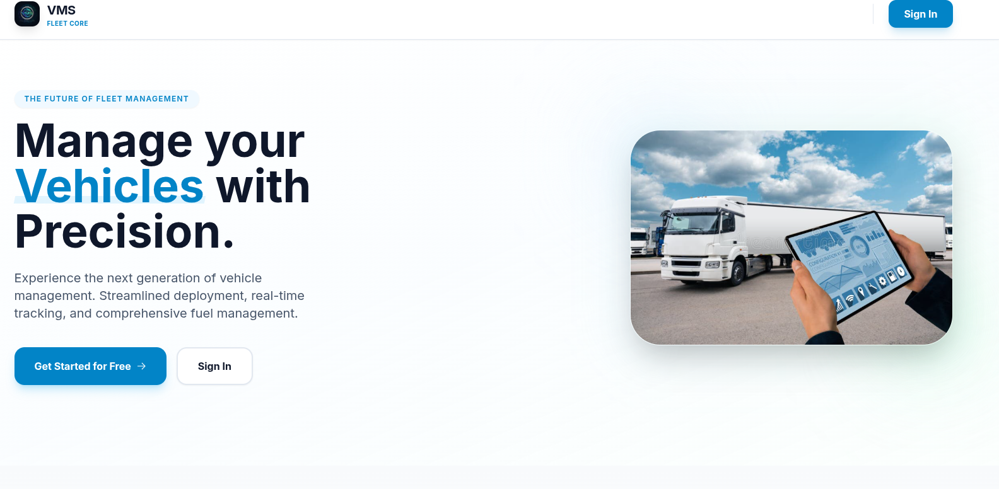
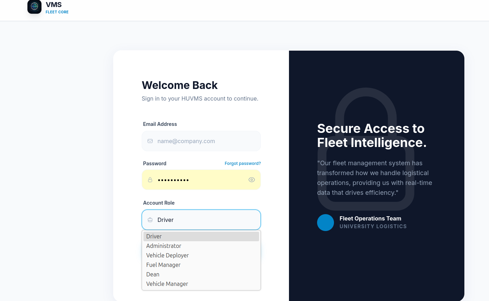
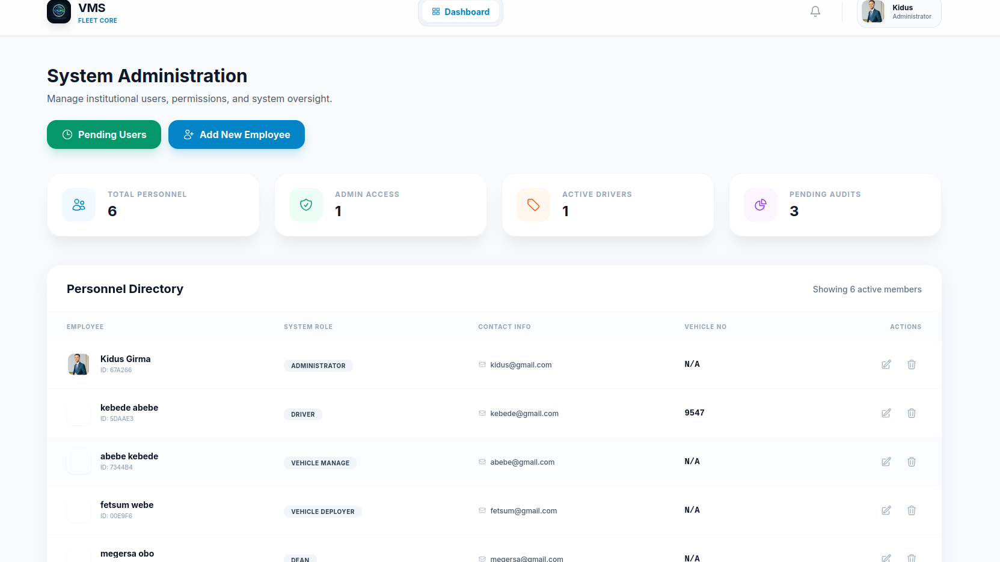
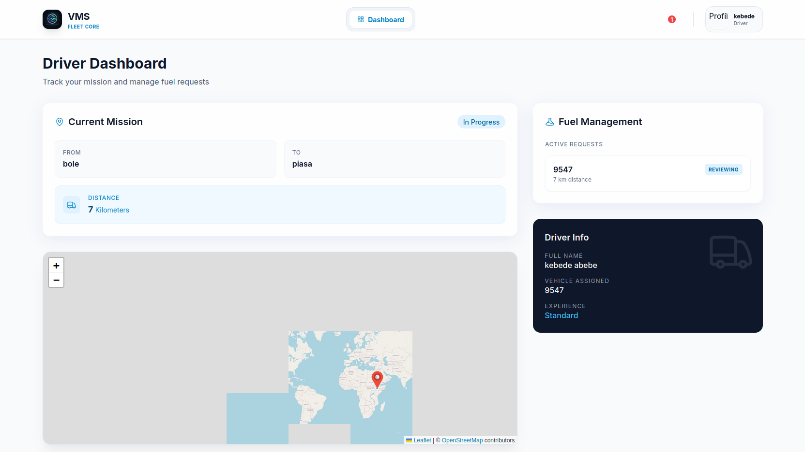
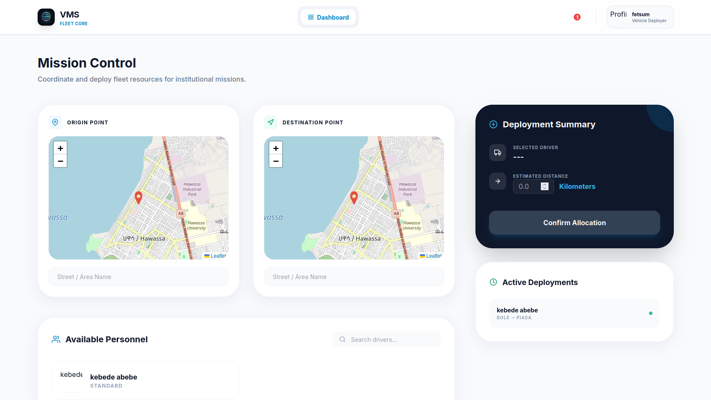

# Vehicle Management System (VMS)

A production-ready MERN stack application designed to streamline enterprise fleet operations.  
The platform integrates mission coordination, fuel consumption workflows, and multi-tier approvals across operational roles.

## Core System Capabilities

### 1) Multi-Role Ecosystem (RBAC)

The system supports six distinct user roles, each with a dedicated dashboard and controlled permissions:

- **Administrator**: System-wide oversight, pending-user approval, and user moderation.
- **Vehicle Manager**: Fleet inventory control and driver-to-vehicle assignment.
- **Vehicle Deployer**: Mission creation and live operational coordination via map-driven flow.
- **Driver**: Mission acknowledgment, route execution, and fuel request submission.
- **Fuel Manager**: Fuel request review, approval decisions, and efficiency auditing.
- **Dean**: High-level analytics, KPI monitoring, and institutional reporting visibility.

### 2) Automated Notification Engine

A server-side notification workflow keeps all roles synchronized with operational events:

- **Mission lifecycle**: Assignment alerts to Drivers and acknowledgment/completion updates to Deployer-side stakeholders.
- **Fuel workflow**: Visibility across Driver -> Fuel Manager -> Dean for traceable approval decisions.
- **Completion tracking**: Mission completion automatically triggers updates for relevant roles and report visibility.

### 3) Interactive Tracking & Analytics

- **Geospatial integration**: Leaflet-based mission mapping and coordinate-aware task handling.
- **Data visualization**: Chart.js-powered views for fuel efficiency, role activity, and utilization trends.

## Technical Architecture

| Layer | Technologies | Key Responsibilities |
|---|---|---|
| Frontend | React 18, Tailwind CSS, Axios | Role-based routing, Context API, responsive user interface |
| Backend | Node.js, Express.js | REST APIs, notification logic, middleware orchestration |
| Database | MongoDB, Mongoose | Persistent models, schema validation, business data relations |
| Security | JWT, Bcrypt, RBAC | Token-based authentication, password hashing, protected routes |
| Storage | Multer | Multipart form-data handling for profile and vehicle media |

## Platform Preview

### 1) Landing Page

Primary public-facing screen introducing the platform, system purpose, and main entry points for sign-in and registration.

### 2) Login Page

Secure role-based authentication screen where users sign in with credentials and enter their respective dashboards.

### 3) Administrator Dashboard

Administration workspace for user governance, pending approvals, and institution-level operational control.

### 4) Driver Dashboard

Driver-focused panel for mission updates, acknowledgment actions, and fuel request initiation during operations.

### 5) Vehicle Deployer Dashboard

Mission deployment interface used to assign routes, coordinate trips, and monitor assignment lifecycle events.

## Security and Performance

- **Data integrity**: Mongoose schemas enforce validation rules and consistent data structures.
- **File safety**: Multer setup uses controlled upload handling and unique filename generation.
- **Authentication flow**: JWT-based session model with guarded routes and role-aware authorization behavior.

## Installation and Setup

### Backend

1. Navigate to `backend/`
2. Install dependencies:
   - `npm install`
3. Configure `.env` with required values:
   - `MONGO_URI`
   - `JWT_SECRET` (or `SECRET`, based on your backend config)
   - `PORT`
   - `FRONTEND_URL`
4. Start the backend:
   - `npm run dev`

### Frontend

1. Navigate to `frontend/`
2. Install dependencies:
   - `npm install`
3. Configure frontend environment:
   - `REACT_APP_API_URL` (or your actual API base variable used in code)
4. Start the frontend:
   - `npm start`
